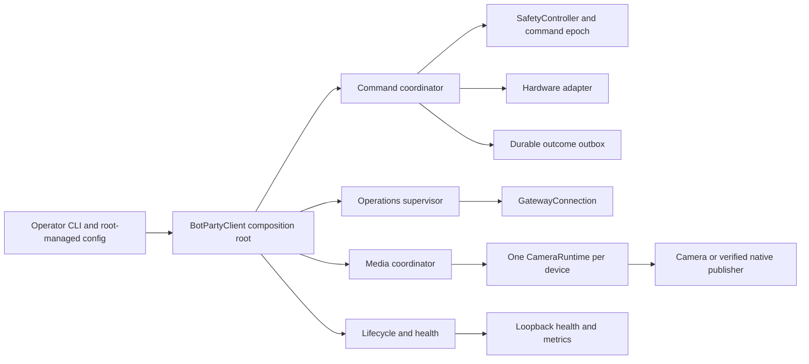
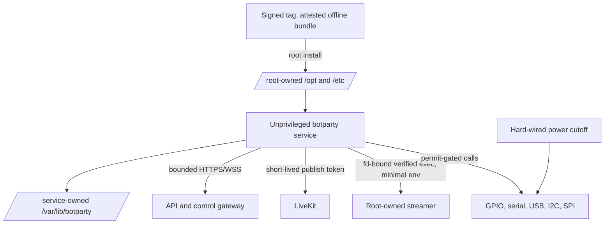
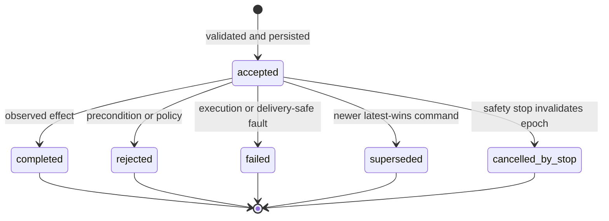
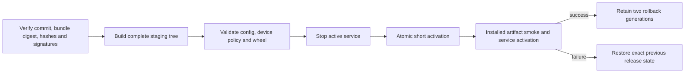

# Architecture and trust boundaries

## Runtime ownership



The composition root owns cross-cutting lifecycle state. Safety, gateway, outcome, diagnostics,
update and camera services own their invariants. Hardware writes require an active command permit;
outcomes are persisted before network delivery; a camera never has two publisher owners.

## Process, credential and storage boundary



Static configuration, native code, launchers, units and trust anchors are read-only to the service.
Device identity, outbox, OTA markers and bounded runtime state are private to the service. Native
children receive only their required environment. Software stop complements, but never replaces,
the independent physical cutoff.

## Command lifecycle



Each subject has at most one `accepted` outcome and exactly one terminal state. Terminal transitions
are immutable. The backend deduplicates deterministic outcome IDs from reconnect delivery.

## Startup and shutdown

```mermaid
sequenceDiagram
  participant S as systemd
  participant C as Client
  participant H as Health/Safety supervisor
  participant P as Platform
  participant M as Media
  S->>C: start
  C->>C: validate config, identity and trust policy
  C->>H: start local liveness, watchdog and latched safety
  C-->>S: locally initialized; readiness remains degraded
  loop reconnecting authentication
    C->>P: claim and open control
  end
  C->>M: connect and publish track
  M-->>C: first new frame
  C-->>S: READY=1
  S->>C: stop
  C->>H: latch and confirm hardware stop
  C->>M: cancel and release publishers
  C->>P: close control and HTTP
  C->>C: close adapter; fail exit if stop is unconfirmed
```

## Installer and OTA transaction



OTA follows the same fail-closed shape with an inactive slot, signed architecture-bound manifest,
pending boot marker, readiness confirmation and automatic rollback.
